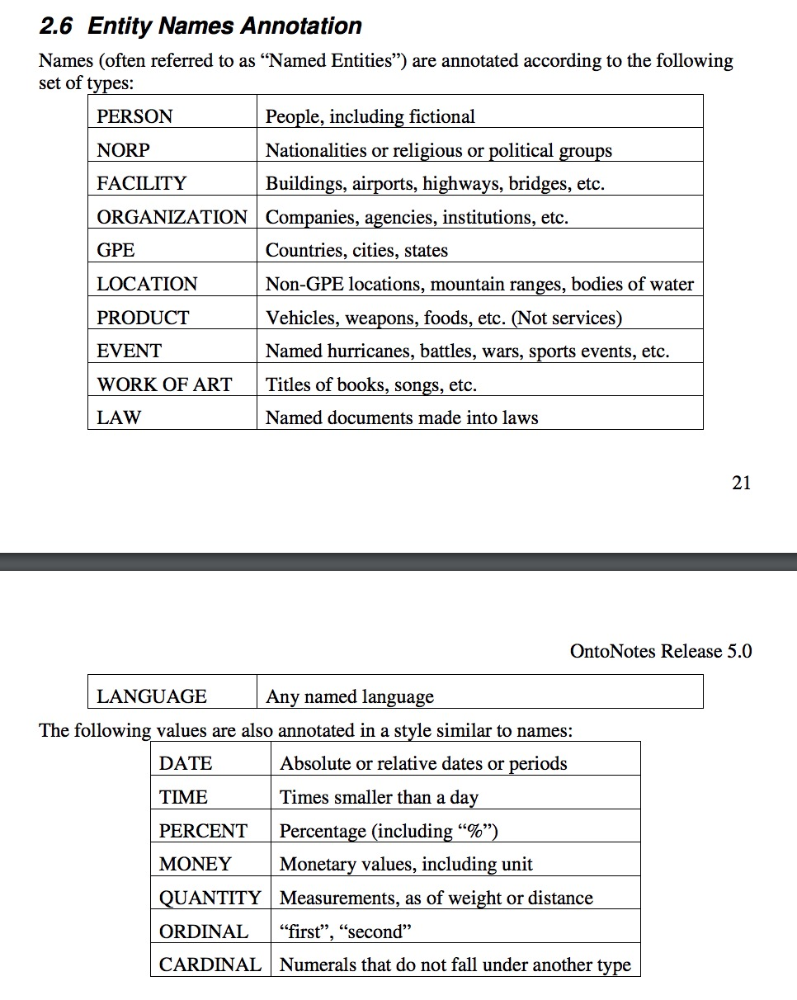

### Basic Concepts
- sequence tagging problem

### Common Methods
- bi-LSTM + CRF
    - Bidirectional LSTM-CRF Models for Sequence Tagging. 2015. Kai Yu et al.
- bert-base
- RoBERTa-wwm-large-ext

### Concepts
- BIO encoding.
    
- BIOES format.

### Systems
- for English
    - spaCy

- for Chinese
    - Stanza, all neural. Bi-LSTM + CRF. 非常好的工具. 18 types OntoNotes Release 5.0. 
    - coreNLP
    
- 工业界
    - [腾讯AI Lab开放文本理解系统TexSmart，让AI想得更深更广](https://mp.weixin.qq.com/s/pLdKTgXogtITR2BvpwEvmg)
        - 只开放了API, 未开源系统
            - 无监督的细粒度实体识别方法
            - 有监督的序列标注模型
            - 腾讯AI Lab在国际大赛夺冠的实体链接方法
          
### 应用
- Tag理解与推荐
- 语义联想
- 深度语义表达

### Dataset 
- [哈工大《大词林》开放75万核心实体词及相关概念、关系列表](https://mp.weixin.qq.com/s/gGig5KFztInrGAmhUhqAkg)
    - 开放域实体知识库
        - 构建过程不需要领域专家的参与，而是基于多信息源自动获取实体类别并对可能的多个类别进行层次化，从而达到知识库自动构建的效果。
        - 其数据规模可以随着互联网中实体词的更新而扩大，很好地解决了以往的人工构建知识库对开放域实体的覆盖程度极为有限的问题。
        - 《大词林》是一个树状的网络，每一个实体的义项均能够唯一对应到细粒度的上位词概念路径且具有丰富的实体和关系数据，能够更加清晰明确的展示实体的含义。
        - 《大词林》中的75万的核心实体词，以及这些核心实体词对应的细粒度概念词（共1.8万概念词，300万实体-概念元组），还有相关的关系三元组（共300万）
- CLUENER 2020: https://github.com/CLUEbenchmark/CLUENER2020
    - 10 types, train: 13k sentences, dev/test: 1.3k sentences, one sentence one example
- (OntoNotes Release 5.0)[https://catalog.ldc.upenn.edu/docs/LDC2013T19/OntoNotes-Release-5.0.pdf]
    - 18 types, page 21 in above pdf.
        
- Chinese dataset 1: https://github.com/zjy-ucas/ChineseNER/tree/master/data 
- English CoNLL-2003: https://github.com/kyzhouhzau/BERT-NER/tree/master/data
- Dh_msra: https://github.com/SophonPlus/ChineseNlpCorpus/blob/master/datasets/dh_msra/intro.ipynb
- msra: https://github.com/Determined22/zh-NER-TF/tree/master/data_path

### Important Papers
- [Natural Language Processing (Almost) from Scratch.](http://jmlr.org/papers/volume12/collobert11a/collobert11a.pdf) 2011.
    - Propose a unified neural network architecture for sequence labeling tasks.
- [CLUENER2020: FINE-GRAINED NAMED ENTITY RECOGNITION DATASET AND BENCHMARK FOR CHINESE.](https://arxiv.org/pdf/2001.04351.pdf) 2020.
    - Chinese Fine-Grained Name Entity, 10 Classes.
- [Neural Entity Typing with Language Model Enhancement]
    - 2020. 利用语言模型指导实体标注;
    - [official code](https://github.com/thunlp/LME)

### Difficults
- Hard to work out boundaries of entity
    - First National Bank Donates 2 Vans To Future School Of Fort Smith
    - Is the first entity “First National Bank” or “National Bank”
- Hard to know if something is an entity
    - Is there a school called “Future School” or is it a future school?
- Hard to know class of unknown/novel entity:
    - What class is “Zig Ziglar”? (A person.)
- Entity class is ambiguous and depends on context
    - “Charles Schwab” is PER
 not ORG here! 
    
### Types
- 